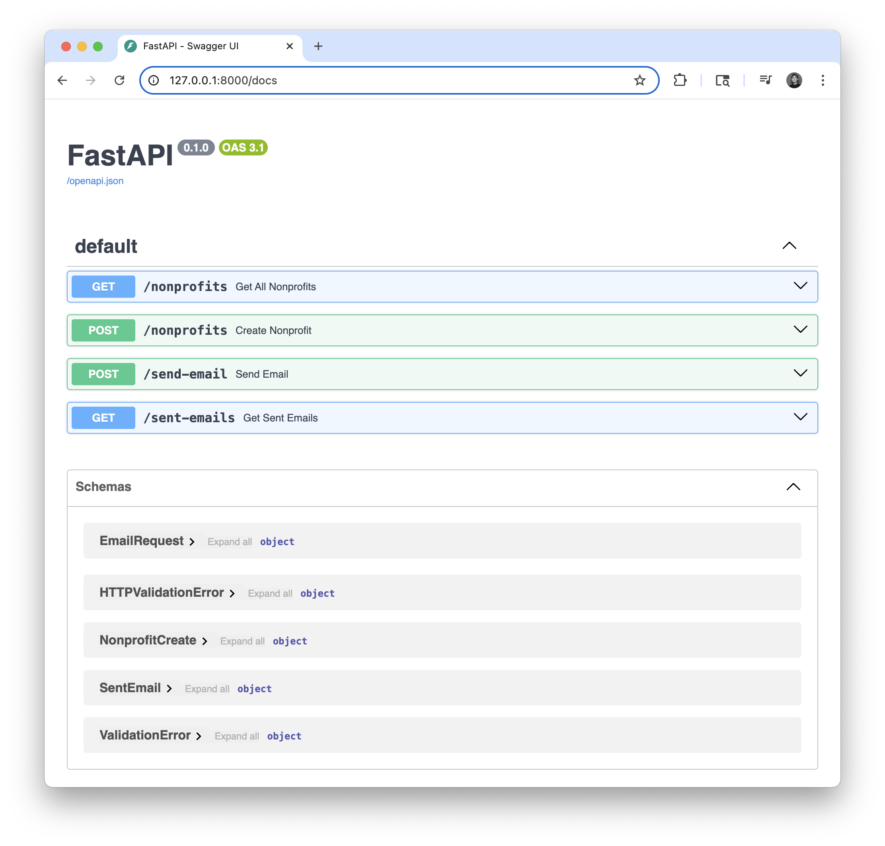

# Nonprofits Workflow Backend

This is a simple backend API implementation for the nonprofits workflow using FastAPI. It simulates a system for nonprofit grant communication and includes functionality to manage nonprofits and send templated emails.

## Features
- Create nonprofits (name, address, email)
- Bulk send templated emails to nonprofits
- Retrieve all sent emails
- Email threading and reply support (email chains)
- In-memory data storage (no database required)
- Mocked email sending (no real emails sent)

## Quickstart

### 1. Install dependencies
```bash
pip install -r requirements.txt
```

### 2. Run the server
```bash
uvicorn main:app --reload
```

### 3. API Docs
Visit [http://127.0.0.1:8000/docs](http://127.0.0.1:8000/docs) for interactive Swagger UI.

Redoc documentation is also available at [http://127.0.0.1:8000/redoc](http://127.0.0.1:8000/redoc).

## 🔍 Preview



## API Endpoints
- `POST /nonprofits` — Create a nonprofit
```json
{
  "name": "Helping Hands",
  "address": "123 Aid St, NY",
  "email": "help@hands.org"
}
```
- `GET /nonprofits` — List all nonprofits
- `POST /send-email` — Send a templated email to nonprofits
```json
{
  "template": "Sending money to nonprofit {name} at address {address}",
  "emails": ["help@hands.org"]
}
```
- `GET /sent-emails` — List all sent emails

### Email Threading & Reply Endpoints
- `POST /emails/{email_id}/reply` — Reply to a sent email (creates a new email in the same thread)
  - Path parameter: `email_id` (the id of the email to reply to)
  - Example body:
    ```json
    {
      "template": "Re: Hello {name}, ...",
      "emails": ["contact@helpinghands.org"],
      "cc": []
    }
    ```
- `GET /threads/{thread_id}/emails` — Get all emails in a thread
  - Path parameter: `thread_id` (the id of the thread)

#### Notes on Email Chains
- Every sent email has a unique `id` and a `thread_id` for chain tracking.
- Replies reference the original email via `in_reply_to` and share the same `thread_id`.

## Notes
- No authentication required
- Email is the unique identifier for nonprofits
- 5 sample nonprofits are preloaded at startup for testing


